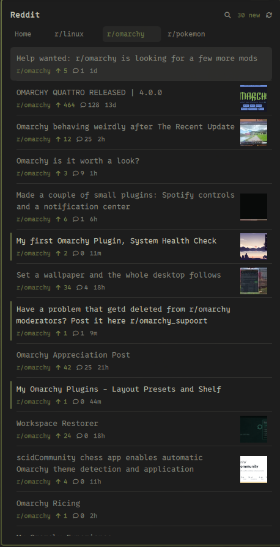
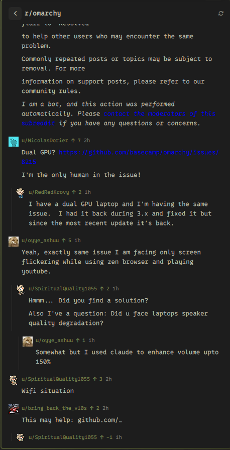
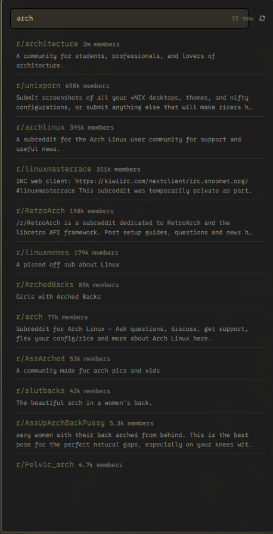

# rdt

Your Reddit feed in the Omarchy bar. An unread count on the pill; the posts and
their comments in the popup.

No API key, no OAuth app, no configuration: the plugin reads the Reddit session
from whichever Chromium-family browser you are already signed in to.

| Your feeds | A post and its comments | Finding a subreddit |
| --- | --- | --- |
|  |  |  |

Pinned subreddits become tabs. Posts carry their thumbnail, score, comment
count and age; a post you have opened dims, and one you upvoted takes the
accent. Opening a post renders its Markdown, its pictures and its comment
tree, with each commenter's avatar resolved for the whole thread in a single
request.

## Requirements

Everything it needs ships with Omarchy already:

- `python3` (used at `/usr/bin/python3`)
- `curl`
- `openssl`
- `secret-tool` (`libsecret`)
- A Chromium-family browser signed in to Reddit: Chromium, Chrome, Brave,
  Vivaldi or Edge
- An unlocked keyring (gnome-keyring or kwallet)

No Python packages are installed and none are needed.

## Install

```bash
omarchy plugin add https://github.com/leonrlr4/rdt.git --enable
```

Or, from a local checkout:

```bash
cp -r . ~/.config/omarchy/plugins/leonrlr4.rdt
omarchy plugin enable leonrlr4.rdt right
```

Check it can see your session:

```bash
~/.config/omarchy/plugins/leonrlr4.rdt/bin/reddit-fetch doctor
```

That prints which browsers were found, whether the keyring could be read, which
Reddit cookies exist and how many hours the access token has left. It never
prints a cookie or a token.

## Use

| Action | Result |
| --- | --- |
| Left click the pill | Open the feed |
| Right click the pill | Refresh now |
| Click a post | Read it, with comments, in the panel |
| Click a subreddit name | Switch to its tab if it is one, otherwise browse it |
| Click 🔍, or press `/` | Search for a subreddit by name |
| Click ☆ while browsing | Pin it as a tab; ★ unpins |
| Hover a tab, click × | Unpin it |
| Middle click a post | Open it in the browser and mark it read |
| `↑` `↓` | Move the cursor through posts; scroll while reading a post |
| `←` `→` | Switch feed tab |
| `Enter` | Open the post under the cursor |
| `Esc` | Back out one level: post, search, subreddit, then close |
| `r` | Refresh |
| `a` | Mark everything read |
| Click "N new" | Mark everything read |

It can also be driven from a keybinding or a script:

```bash
omarchy-shell leonrlr4.rdt toggle
omarchy-shell leonrlr4.rdt refresh
omarchy-shell leonrlr4.rdt markAllRead
```

## Settings

Configure in the bar's widget settings, or with `omarchy bar set`:

```bash
omarchy bar set leonrlr4.rdt feeds "best,r/omarchy,r/linux"
```

| Key | Default | Meaning |
| --- | --- | --- |
| `feeds` | `best` | Comma separated. `best` is your subscribed front page; anything else is a subreddit, with or without the `r/` prefix. Each name becomes a tab. The ☆ and × in the panel edit this for you. |
| `refreshMinutes` | `0` | `0` fetches only when you open the panel. Any value of 2 or more also refreshes in the background, keeping the unread count live between opens. |
| `limit` | `25` | Posts fetched per feed. |
| `browser` | *(empty)* | Force a browser instead of auto-detecting: `chromium`, `chrome`, `brave`, `vivaldi`, `edge`. |
| `hideWhenRead` | `false` | Hide the pill entirely when nothing is unread. |
| `showImages` | `true` | Thumbnails in the list and the post's picture in the reading view. Reddit's downscaled renditions, never the full-size original. |

### When it fetches

By default the plugin does not poll. It fetches once shortly after the shell
starts, so the pill carries a real count, and then only when you open the
panel — opening twice within 30 seconds reuses the first result rather than
spending a second request. Comments are fetched only when you open a post.

Reddit allows 100 requests per 10 minutes on this path, and one fetch spends
one request per feed, so on-demand use is nowhere near the limit. Setting
`refreshMinutes` trades some of that budget for an unread count that stays
live while the panel is closed: three feeds polled every 5 minutes uses 6%.

## What the panel draws

Posts are rendered as Reddit writes them. Selftext and comments are CommonMark
and Qt renders them as such, so bold, italics, lists, quotes, code and links
arrive as formatting rather than as punctuation. Reddit ends a line wherever
the author pressed enter, which CommonMark would fold into a space, so single
newlines are converted to hard breaks before rendering — otherwise a comment
written as five short lines arrives as one run-on paragraph.

Pictures use Reddit's own published renditions: the 140px square crop for a
list row, and the smallest rendition at least 640px wide for the reading view.
The `url` on an image post is the full-resolution original — routinely over a
megabyte — which is far more than a panel needs to draw a 400px-wide picture.

Gallery posts need the reading view. They carry no `preview` at all; their
pictures live in `gallery_data` paired with `media_metadata`, and the listing
endpoints strip both, so a gallery has no list thumbnail and all of its images
once opened. Reddit-hosted video is a DASH stream the panel cannot play, so its
frame is marked with a play badge and clicking it opens the browser.

Inline media in comments is drawn too. Reddit writes a comment GIF as
`` — an id, not a URL — so a Markdown renderer draws a
broken-image icon where the GIF should be. Those embeds are lifted out of the
text before rendering and drawn as real animated images at a width the panel
chooses, using Giphy's 200px rendition. Subreddit emotes have no stable public
URL and are dropped rather than drawn as placeholders.

Colour carries meaning rather than decoration: the subreddit, the score, the
author and the timestamp each take a different role from the theme, and a post
you have already opened keeps its title at the weight of secondary text. The
panel opens at 80% of the display height, clamped to whatever the bar leaves.

## Tabs and browsing

Escape or the back arrow pops one level at a time:

```
tabs  →  a subreddit (clicked or searched)  →  a post and its comments
```

Clicking a subreddit name reaches only what is already in your feed, and if it
is already a tab it simply switches to that tab rather than opening a second
view of it. Search reaches everything else: `/subreddits/search`, one request
per settled query rather than one per keystroke, so typing "neovim" costs one.
It searches rather than autocompletes on purpose — "neovim" also turns up
r/vim and r/unixporn, which is the point of looking for a subreddit you cannot
already name.

Opening a subreddit does not add a tab, because looking is not the same as
keeping. The star in the header is what turns one into the other,
and it writes the `feeds` setting — so a pinned tab survives a restart. Hovering
a tab reveals an × that unpins it; unpinning the last one leaves the front page
rather than an empty panel.

Pinning writes `shell.json`, which makes the shell reload. That is the same path
the first-party clock uses to remember a cycled format, and it is fine here for
the same reason: it happens when you click a star, not on a timer. The rule it
does not break is the one about read state, which changes every poll and so
lives in a cache file instead.

## How authentication works

`bin/reddit-fetch` reads two cookies out of the browser's cookie store,
decrypting them with the browser's "Safe Storage" key from your keyring, and
uses whichever is usable:

1. `token_v2` as a Bearer token against `oauth.reddit.com`. This is the OAuth
   access token Reddit's own web client uses. It lives 24 hours and the browser
   renews it while you browse. Its expiry is read locally out of the JWT, so a
   stale token is detected without spending a request.
2. `reddit_session` as a cookie against `www.reddit.com/*.json`, used when the
   token is stale. This cookie lives about six months, so the plugin keeps
   working through weeks of not opening Reddit in the browser.

Anonymous access is not a fallback: `www.reddit.com/*.json` answers 403 without
auth, and the anonymous `.rss` feed is capped at one request per 60 seconds,
which is far too tight to drive a bar widget.

### What this means for you

- **Nothing is written to disk.** Cookies live in the memory of a process that
  runs for about a second per fetch. `doctor` is careful never to print them.
- **Read only.** The plugin issues GETs. It never votes, comments, saves or
  posts.
- **It is not the official API.** Driving reddit.com with a browser session
  rather than a registered OAuth app is against Reddit's terms of use. Fetching
  only when you open the panel puts the traffic far below normal browsing, but
  the risk to your account is not zero. Decide for yourself.
- **Unsandboxed.** Like every Omarchy plugin, this runs inside the shell
  process with your user's permissions.

## Read state

Which posts you have already seen is a cache, kept at
`~/.cache/rdt/seen.json` — deliberately *not* in `shell.json`, which
the shell hot-reloads whenever it is written. The newest 500 ids are kept.

Delete that file to mark everything unread again.

## Troubleshooting

Run `bin/reddit-fetch doctor` first. The pill also shows a short code, and the
panel shows the full message.

| Pill | Cause |
| --- | --- |
| `no browser` | No Chromium-family profile found. |
| `log in` | Browser found, but it holds no Reddit session. |
| `keyring` | The keyring is locked, so the cookie key cannot be read. |
| `session` | Reddit rejected the session. Open Reddit in the browser again. |
| `offline` | Could not reach Reddit. |
| `throttled` | Rate limited; the next poll backs off. |

A failed fetch never blanks the feed: whatever was last fetched stays on screen
under the error.

## Development

```bash
/usr/bin/python3 tests/test_fetch.py                          # 114 checks
/usr/lib/qt6/bin/qml -platform offscreen tests/test_model.qml  # 34 checks
omarchy plugin validate .
```

`test_fetch.py` is stdlib unittest and touches neither the network nor the real
cookie store. `test_model.qml` covers the feed-list logic that has to run inside
the panel; it reports only through its exit code, because the qml runtime under
`-platform offscreen` prints nothing at all.

Saving any file under `~/.config/omarchy/plugins/` hot-reloads the plugin —
but only its entry point. `Panel.qml` is pulled in by a `Loader`, and the
running shell keeps serving the previous build of it from its component cache:
the journal says it reloaded, the file on disk is plainly different, and the
panel still paints the old version, with no error anywhere. Changes below
`BarWidget.qml` need a full restart:

```bash
rm -rf ~/.cache/quickshell/qmlcache && omarchy restart shell
```

A screenshot taken after a hot reload is not evidence that a `Panel.qml`
change works.

Static checks against the shell's own imports need a `qs` alias pointing at the
shell root:

```bash
mkdir -p /tmp/qmlroot && ln -sfn /usr/share/omarchy/shell /tmp/qmlroot/qs
qmllint -I /tmp/qmlroot -I /usr/lib/qt6/qml BarWidget.qml Panel.qml
```

### Colours and type

Nothing in the QML is a literal colour or a hand-picked pixel size. Colours are
bindings onto `Color.popups.*`, so a theme switch repaints the panel; secondary
text is that surface's own text at reduced alpha rather than `Color.muted`,
because `muted` falls back to `color8` when a theme omits it, which lands near
the background on dark themes. Sizes come from `Style.font.caption` /
`bodySmall` / `body` / `subtitle`, never from arithmetic on `body` — multiplying
it produces sizes below the shell's own smallest token and ignores per-token
overrides, which is how this panel first shipped with 8px comment bylines.

`missing-property` and `unqualified` warnings are expected — the shell's `Style`
and `Color` singletons are `QtObject` groups that qmllint cannot resolve
statically, and first-party widgets produce the same ones. Two
`signal-handler-parameters` warnings on `Process.onExited` are also expected:
the signal's second parameter is a C++ enum with no QML type.

## Remove

```bash
omarchy plugin remove leonrlr4.rdt
rm -rf ~/.cache/rdt
```

## License

MIT. See `LICENSE`.
